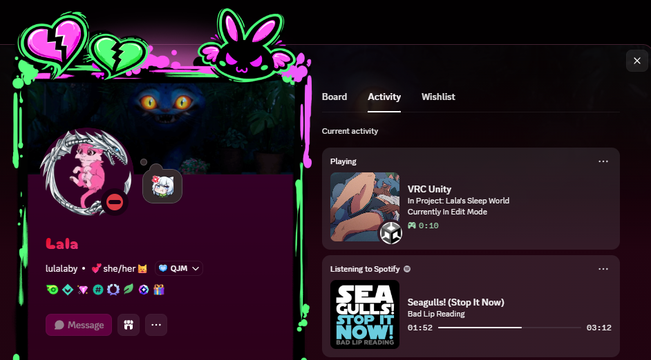
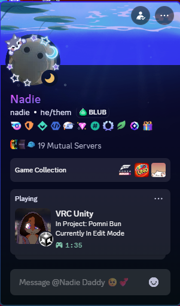
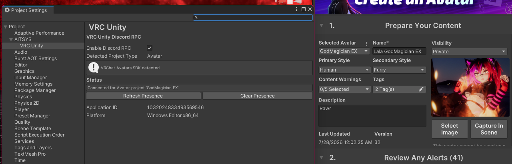
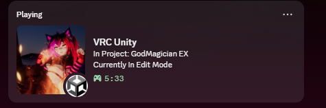
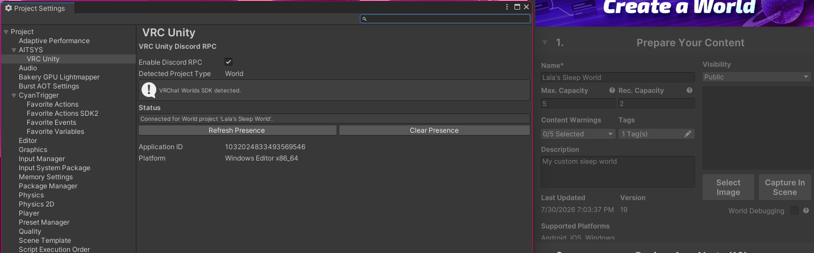
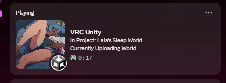
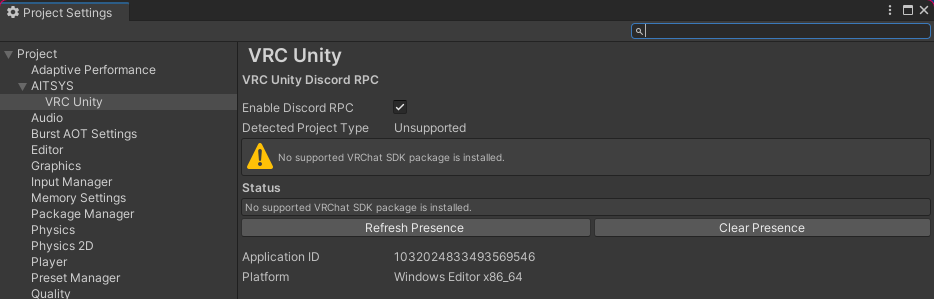
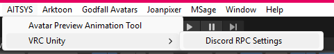

# VRC Unity Discord RPC

Discord Rich Presence for Unity projects using the VRChat SDK.

The package shows what kind of VRChat project you are working on and whether
you are editing, testing, building, or uploading it. It runs entirely inside
the Windows Unity Editor and is not included in uploaded worlds or avatars.

## Features

- Automatically detects VRChat World and Avatar projects.
- Reports Edit Mode, Play Mode, Build, and Upload states to Discord.
- Restarts the elapsed activity timer when your workflow state changes.
- Uses the active scene's descriptor when multiple scenes are loaded.
- Refreshes automatically when scenes, descriptors, or blueprint IDs change.
- Uses the VRChat project name and thumbnail when blueprint metadata is available.
- Falls back to local descriptor details if the VRChat API is unavailable, then retries quietly.
- Stores the enabled state per Unity project in `ProjectSettings`.
- Does not modify project-wide scripting define symbols.
- Requires only the VRChat Base SDK at package level.
- Runs only in the Windows x86_64 Editor and is excluded from client builds.
- Removes files from the previous `Assets`-based installation during VPM migration.

The package does not provide Discord invites, join buttons, or access to your
Unity project. Rich Presence only publishes the activity text and artwork
shown in the examples above.

## Project Detection

### Avatar Projects

Projects containing the VRChat Avatars SDK and a loaded avatar descriptor are
detected automatically. Discord displays the avatar project name and its
current Edit, Play, Build, or Upload state.

### World Projects

Projects containing the VRChat Worlds SDK and a loaded world descriptor are
detected automatically. Detection follows the active loaded scene, so changing
between scenes with different world descriptors updates the presence.

### Unsupported Projects

Rich Presence remains inactive when no supported descriptor is loaded, when
neither SDK is installed, or when both the Worlds and Avatars SDKs make the
project type ambiguous. The settings page explains the detected condition.

## Installation

Add the [AITSYS VCC](https://vcc.aitsys.dev) listing to the VRChat Creator Companion or ALCOM:

`https://vcc.aitsys.dev/index.json`

Then add **VRC Unity Discord RPC** to the desired project. Updates are delivered
through the same listing.

The package targets Unity `2022.3.22f1` and the Windows x86_64 Editor. Discord
Desktop must be running for Rich Presence to appear.

## Settings

Open `AITSYS > VRC Unity > Discord RPC Settings`.

The settings page lets you:

- Enable or disable Rich Presence for the current Unity project.
- View the detected project type and connection status.
- Refresh the current presence manually.
- Clear the current Discord presence.

The preference is stored in
`ProjectSettings/VRCUnityDiscordRPCSettings.asset` and does not require a scene
component.

## Package

- Package ID: `dev.aitsys.vrc-discord-rpc`
- Unity: `2022.3.22f1`
- Platform: Windows Editor x86_64
- VPM dependency: `com.vrchat.base >= 3.10.0`
- Settings: `AITSYS > VRC Unity > Discord RPC Settings`

## Development

The distributable VPM package lives at
`Packages/dev.aitsys.vrc-discord-rpc`. The root Unity project is a minimal test
host; unrelated SDKs and Unity packages are intentionally excluded.

The `Build Release` GitHub Actions workflow publishes the version declared in
the package's `package.json`. Release tags use the `vX.Y.Z` convention, while
the package version remains `X.Y.Z`. The repository variable `PACKAGE_NAME`
must remain `dev.aitsys.vrc-discord-rpc`.

## License

The package source is available under the MIT License. The bundled Discord RPC
native library is also MIT licensed; see
`Packages/dev.aitsys.vrc-discord-rpc/ThirdPartyNotices.md`.
